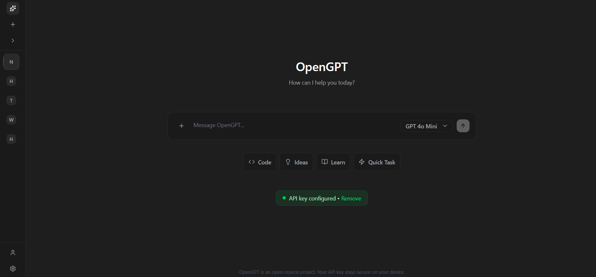

# 🚀 OpenGPT

**The Open Source ChatGPT Alternative - Bring Your Own API Key**

[](https://nextjs.org/)
[](https://www.typescriptlang.org/)
[](https://tailwindcss.com/)
[](https://opensource.org/licenses/MIT)

> 🎯 **Mission**: Make AI accessible to everyone by providing a free, open-source ChatGPT interface where users can use their own OpenAI API keys.

## 📸 Preview



_OpenGPT's clean and intuitive interface - bringing the power of ChatGPT with your own API key_

## ✨ Features

### 🔥 **Core Features**

- 💬 **ChatGPT-like Interface** - Familiar and intuitive chat experience
- 🔑 **Bring Your Own API Key** - No subscription fees, use your OpenAI credits
- 🌙 **Beautiful Dark Theme** - Polished UI matching modern design standards
- 📱 **Fully Responsive** - Perfect on desktop, tablet, and mobile
- ⚡ **Real-time Streaming** - See responses as they're generated
- 💾 **Chat History** - Save and manage your conversation history
- 🗂️ **Multiple Conversations** - Organize chats with custom titles

### 🛡️ **Security & Privacy**

- 🔐 **Encrypted API Key Storage** - Your keys are safely encrypted
- 🚫 **No Data Tracking** - We don't store or analyze your conversations
- 🔒 **Local Storage** - All data stays on your device
- 🛡️ **XSS Protection** - Secure against common web vulnerabilities
- ⚡ **Rate Limiting** - Built-in protection against API abuse

### 🎨 **User Experience**

- 🎭 **Smooth Animations** - Delightful micro-interactions
- 🎯 **Keyboard Shortcuts** - Power user friendly
- 📤 **Export Conversations** - Download your chats as JSON/Markdown
- 🔍 **Search History** - Find previous conversations quickly
- ⚙️ **Customizable Settings** - Adjust model parameters and preferences

## 🚀 Quick Start

### Prerequisites

- Node.js 18+
- npm/yarn/pnpm
- OpenAI API Key ([Get yours here](https://platform.openai.com/api-keys))

### Installation

1. **Clone the repository**

```bash
git clone https://github.com/royxlab/OpenGPT.git
cd OpenGPT
```

2. **Install dependencies**

```bash
npm install
# or
yarn install
# or
pnpm install
```

3. **Set up environment variables**

```bash
cp .env.example .env.local
```

Edit `.env.local`:

```env
# Required
NEXTAUTH_SECRET=your-secret-key-here
ENCRYPTION_KEY=your-32-character-encryption-key

# Optional
NEXT_PUBLIC_APP_NAME=OpenGPT
NEXT_PUBLIC_APP_URL=http://localhost:3000
```

4. **Run the development server**

```bash
npm run dev
# or
yarn dev
# or
pnpm dev
```

5. **Open your browser**
   Navigate to [http://localhost:3000](http://localhost:3000)

## 📖 Usage

### Getting Started

1. **Add your API Key**: Click the settings icon and securely add your OpenAI API key
2. **Start Chatting**: Begin a new conversation or continue an existing one
3. **Customize**: Adjust model settings, temperature, and other parameters
4. **Export**: Download your conversations for backup or sharing

### API Key Setup

```typescript
// Your API key is encrypted before storage
// Never shared with external services
// Stored locally in your browser
```

## 🏗️ Architecture

### Tech Stack

- **Framework**: Next.js 14+ (App Router)
- **Language**: TypeScript
- **Styling**: Tailwind CSS + shadcn/ui
- **Database**: Prisma + SQLite/PostgreSQL
- **State Management**: Zustand
- **Authentication**: NextAuth.js
- **Deployment**: Vercel/Docker

### Project Structure

```
src/
├── app/                    # Next.js App Router
│   ├── (auth)/            # Authentication pages
│   ├── (chat)/            # Chat interface
│   ├── api/               # API routes
│   └── layout.tsx         # Root layout
├── components/            # React components
│   ├── ui/               # shadcn/ui components
│   ├── chat/             # Chat components
│   ├── sidebar/          # Sidebar components
│   └── common/           # Shared components
├── lib/                  # Utility functions
├── hooks/               # Custom React hooks
├── types/               # TypeScript definitions
└── store/              # Global state management
```

### Key Components

```typescript
// Chat Interface
<ChatContainer>
  <MessageList>
    <MessageItem />
  </MessageList>
  <InputArea />
</ChatContainer>

// Sidebar Navigation
<Sidebar>
  <NewChatButton />
  <ChatHistory />
  <SettingsPanel />
</Sidebar>
```

## 🔧 Configuration

### Environment Variables

```env
# Security
NEXTAUTH_SECRET=                    # NextAuth.js secret
ENCRYPTION_KEY=                     # API key encryption

# Database
DATABASE_URL=                       # Database connection

# Optional
NEXT_PUBLIC_APP_NAME=OpenGPT       # App name
NEXT_PUBLIC_APP_URL=               # App URL
OPENAI_API_BASE=                   # Custom OpenAI endpoint
```

### Model Configuration

```typescript
// Supported models
const MODELS = [
  "gpt-4-turbo-preview",
  "gpt-4",
  "gpt-3.5-turbo",
  "gpt-3.5-turbo-16k",
];

// Default settings
const DEFAULT_CONFIG = {
  model: "gpt-3.5-turbo",
  temperature: 0.7,
  maxTokens: 2048,
  topP: 1,
  frequencyPenalty: 0,
  presencePenalty: 0,
};
```

## 🚀 Deployment

### Vercel (Recommended)

[](https://vercel.com/new/clone?repository-url=https://github.com/yourusername/OpenGPT)

1. **Fork this repository**
2. **Connect to Vercel**
3. **Set environment variables**
4. **Deploy**

### Docker

```bash
# Build the image
docker build -t OpenGPT .

# Run the container
docker run -p 3000:3000 -e NEXTAUTH_SECRET=your-secret OpenGPT
```

### Self-Hosting

```bash
# Build for production
npm run build

# Start the production server
npm start
```

## 🛠️ Development

### Scripts

```bash
npm run dev          # Start development server
npm run build        # Build for production
npm run start        # Start production server
npm run lint         # Run ESLint
npm run type-check   # Run TypeScript checks
npm test            # Run tests
```

### Code Quality

- **TypeScript**: Strict mode enabled
- **ESLint**: Airbnb configuration
- **Prettier**: Code formatting
- **Husky**: Pre-commit hooks
- **Commitlint**: Conventional commits

### Testing

```bash
# Unit tests
npm run test

# E2E tests
npm run test:e2e

# Coverage report
npm run test:coverage
```

## 🤝 Contributing

We love your input! We want to make contributing as easy and transparent as possible.

### Ways to Contribute

- 🐛 **Bug Reports**: Found a bug? Please create an issue
- 💡 **Feature Requests**: Have an idea? We'd love to hear it
- 📝 **Documentation**: Help improve our docs
- 🔧 **Code**: Submit a pull request

### Development Setup

1. Fork the repository
2. Create your feature branch (`git checkout -b feature/amazing-feature`)
3. Make your changes
4. Add tests if applicable
5. Commit your changes (`git commit -m 'Add amazing feature'`)
6. Push to the branch (`git push origin feature/amazing-feature`)
7. Open a Pull Request

### Code Style

- Use TypeScript for all new files
- Follow the existing code style
- Add JSDoc comments for functions
- Write tests for new features

## 📄 License

This project is licensed under the MIT License - see the [LICENSE](LICENSE) file for details.

## 🙏 Acknowledgments

- **OpenAI** - For providing the amazing GPT models
- **Vercel** - For the incredible Next.js framework
- **shadcn** - For the beautiful UI components
- **The Open Source Community** - For inspiration and support

## 📞 Support

### Need Help?

- 📖 **Documentation**: Comming Soon
- 💬 **Discussions**: Join our [GitHub Discussions](https://github.com/royxlab/OpenGPT/discussions)
- 🐛 **Issues**: Report bugs in [Issues](https://github.com/royxlab/OpenGPT/issues)
- 📧 **Email**: Contact us at royxlab@gmail.com

### FAQ

**Q: Do you store my API key?**
A: No, your API key is encrypted and stored locally in your browser.

**Q: Can I use other AI providers?**
A: Currently we support OpenAI, but we're working on adding more providers.

**Q: Is this really free?**
A: Yes! OpenGPT is completely free. You only pay for your OpenAI API usage.

**Q: Can I self-host this?**
A: Absolutely! Check our deployment guide above.

---

<div align="center">

**Made with ❤️ by Roy**

**⭐ Star us on GitHub if you find this project useful!**

</div>

---

## 📊 Stats


## 🗺️ Roadmap

- [ ] **Multi-provider Support** (Anthropic, Cohere, etc.)
- [ ] **Plugin System** for custom extensions
- [ ] **Voice Input/Output** integration
- [ ] **Team Collaboration** features
- [ ] **Advanced Prompt Templates**
- [ ] **Mobile App** (React Native)
- [ ] **Desktop App** (Electron)
- [ ] **AI Model Fine-tuning** interface

---

_Last updated: August 2025_
